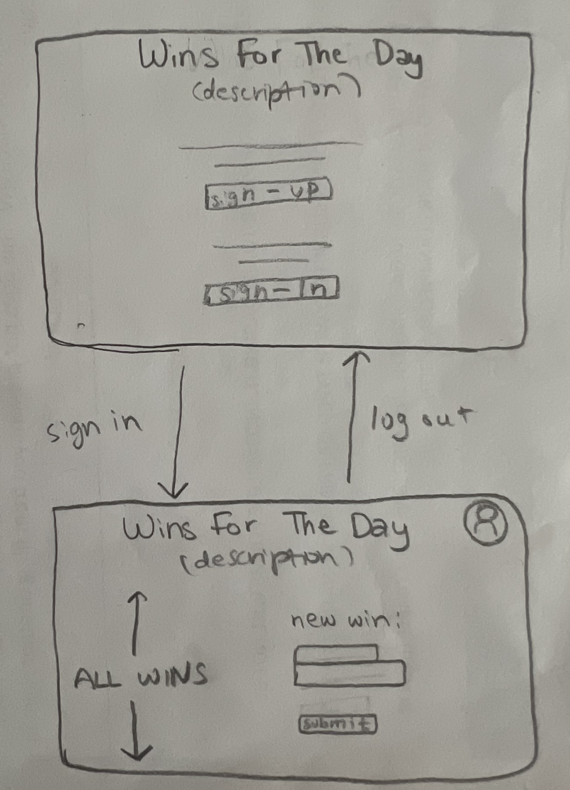

# The Win Tracker

The deployed app can be found [here.](https://steph-kimm.github.io/win-tracker/)

## Objective 
 - This is an app that allows a user to create an account and use it to keep track of their successes.
 - The user is also able to edit or delete wins
 - The wireframe I created for reference can be seen below

## Implementation 
  - The design in minimal as it's purpose was to practice coding with a database and user authentication. 
 - The api used was created myself using Express and deployed with Heroku. The backend documentation can be found [here.](https://github.com/steph-kimm/win-tracker-api)

## User Stories

### win tracker 
- As a user, I want to be able to see my past wins.
- As a user, I want to be able to add things to my Wins list.
- As a user, I want to be able to delete old wins if I want.
- As a user, I want to be able to edit wins if I want.

### authentication
- As a user, I want to be able to create an account.
- As a user, I want to be able to log into my account.
- As a user, I want to be able to log out of my account.

